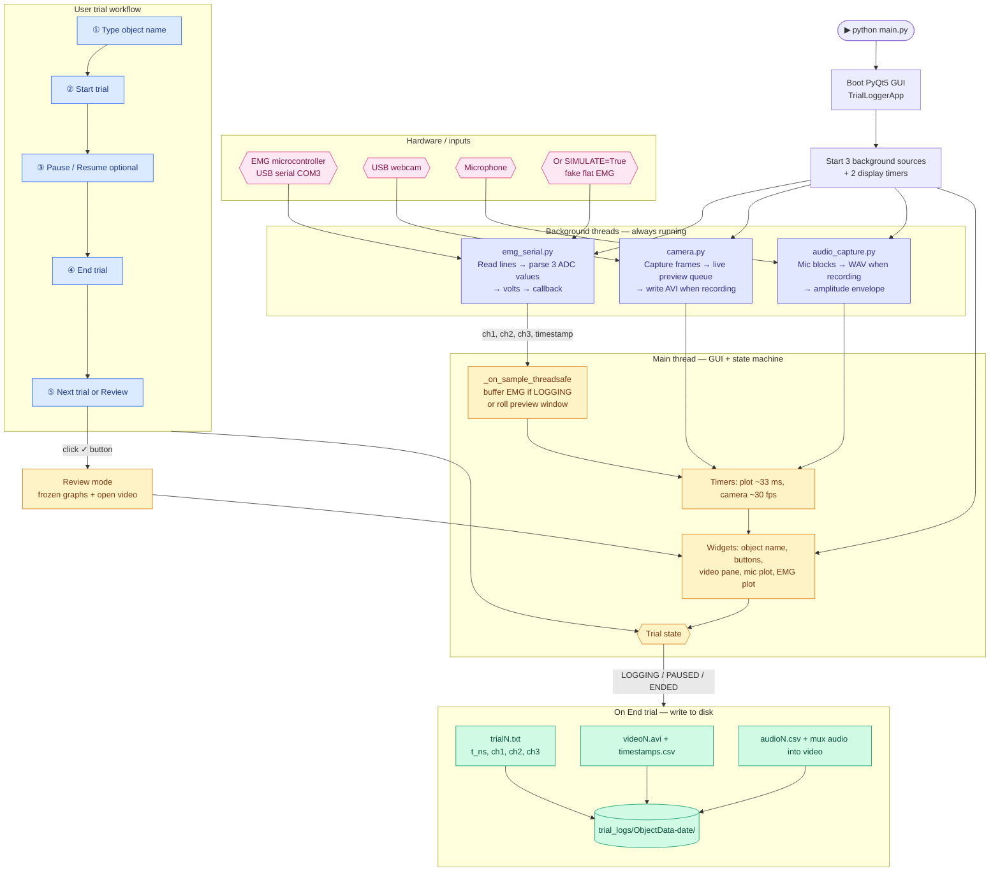
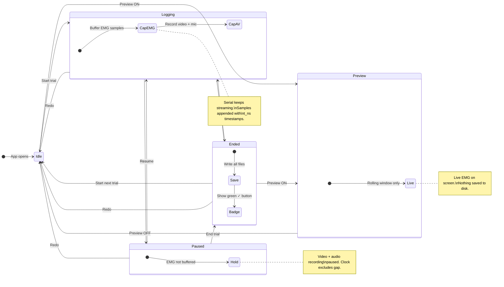
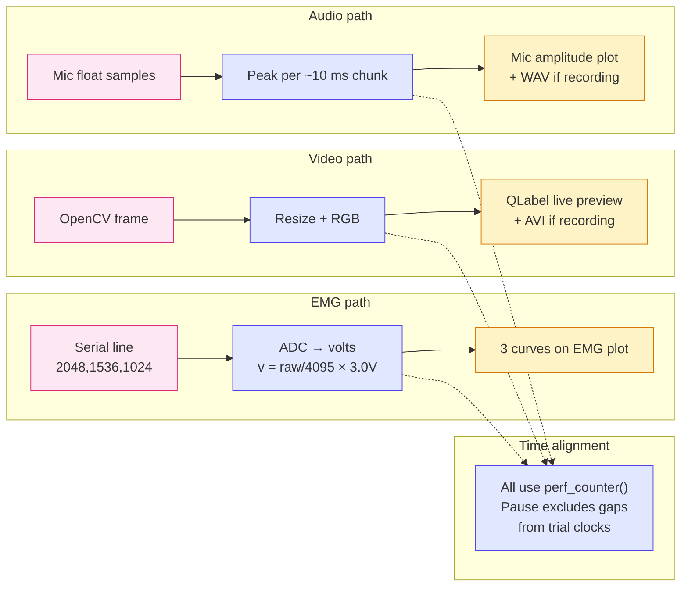
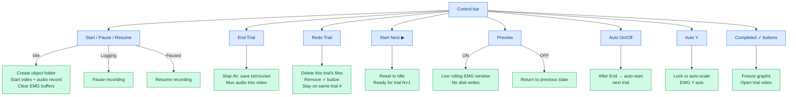
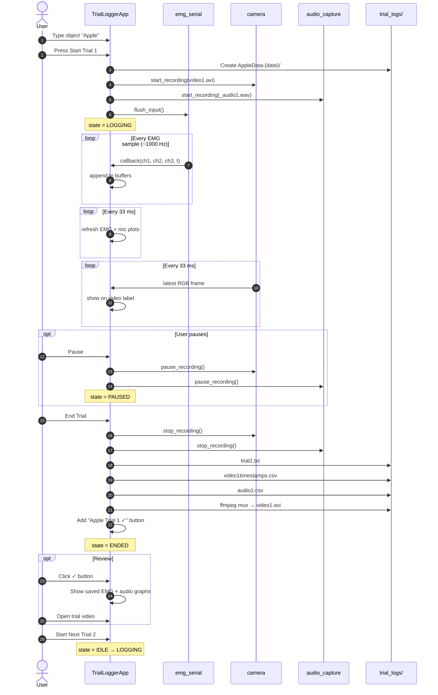

# EMG Trial Logger — System Flowchart

> Run with: `python main.py`  
> Modules: `main.py` → `app.py` + `config.py` + `emg_serial.py` + `camera.py` + `audio_capture.py` + `theme.py`

---

## Master diagram — full system at a glance



---

## Trial state machine



---

## Data paths — how each signal reaches the screen



---

## Button map — what each control does



---

## End-to-end sequence — one complete trial



---

## Quick reference

| Piece | File | What it does |
|-------|------|----------------|
| Entry | `main.py` | Starts Qt event loop |
| Settings | `config.py` | Ports, camera, ADC scale, save folder |
| GUI + logic | `app.py` | State machine, plots, save, review |
| EMG input | `emg_serial.py` | Serial MCU or simulated source |
| Video | `camera.py` | Webcam preview + AVI per trial |
| Audio | `audio_capture.py` | Mic WAV + envelope plot |
| Look | `theme.py` | Light / dark colors |

**Output folder example:**
```
trial_logs/
  AppleData-2026-06-22 09-53-33 AM/
    trial1.txt
    video1.avi
    video1timestamps.csv
    audio1.csv
    trial2.txt
    ...
```
